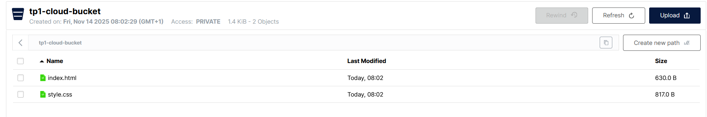
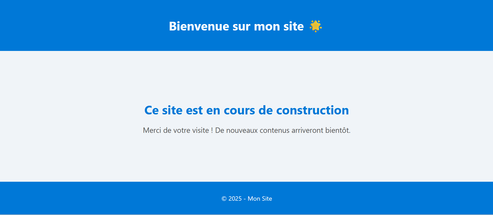

### TP MINIO

tofu init

tofu plan

tofu apply

ajout du html css dans le bucket

ajout des secrets pour le mdp et l'id du compte minio
ajout d'un fichier secret.tfvars.example

La page html n'était pas accéssible a l'affichage juste dans le bucket
ajout de resource "minio_iam_policy" "public_policy" pour ouvrir l'accès à la page

ajout d'un outputs.tf pour avoir des infos apres le tofu apply

bucket_name = "tp1-cloud-bucket"
css_url = "http://127.0.0.1:9000/tp1-cloud-bucket/style.css"
index_url = "http://127.0.0.1:9000/tp1-cloud-bucket/index.html"

avec les secrets ont fait : tofu apply -var-file="secrets.tfvars